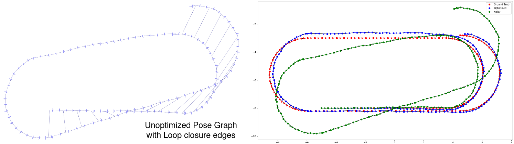
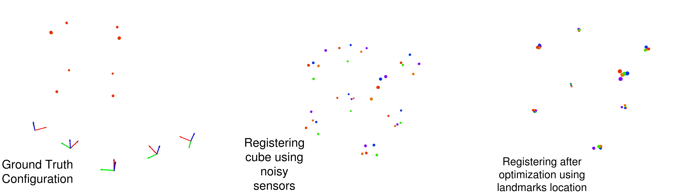

# gtsam_tutorial  

1. This repository is the tutorial on the general edge types(EDGE_SE2 and EDGE_SE3) and vertex types(VERTEX_SE2 & VERTEX_SE3) found in [g2o](https://github.com/RainerKuemmerle/g2o), using python. The accompanied documentation on results can be found in the [notion page](https://hirohamada.notion.site/Graph-Based-SLAM-6e550b19ebff41b9a8550b9c4442d742).  
2. We have covered two common scenarios found in SLAM: Pose Graph SLAM and Landmark based SLAM using synthetic dataset. The main goal is to cover how to formulate a graph based optimization problem in proper g2o format, using g2o's vertices, edges and information matrix.  
3. Problem statement:  
	1. Pose Graph SLAM: A robot is travelling in a oval trajectory. It is equipped with wheel odometry for odometry information and RGBD sensors for loop closure and ICP transformation. Due to noise in wheel odometry it generated a noisy estimate of the trajectory. Our task is to use loop closure pairs to correct the drift.  
	  
	2. Landmark SLAM: A robot observes a cube from five different locations. The robot is equipped with RGBD sensors and would be using those to calculate odometry and the map of the cube. Due to noise in the sensors, it obtained a erroneous estimate of its poses and vertices of the cube. Our task is to couple odometry measurements and cube's vertices(landmarks) measurements to generate a consistent and better estimate of those values.  
	  
4. Installation:  
	1. You can either install using gtsam python package using command: `pip install gtsam` or build gtsam from [source](https://github.com/borglab/gtsam/blob/develop/INSTALL.md).  
	2. Other common dependencies are:   
		`open3d, scipy, numpy, math, matplotlib`  
5. Directory structure:  
	1. `pgSLAM`: [pgSlam.ipynb](pgSlam/pgSlam.ipynb):  Modular and detailed implementation of each function in the `pgSlam.py`.  
	2. `landmarkSlam`: [landmarkSlam.ipynb](landmarkSlam/landmarkSlam.ipynb):  Modular and detailed implementation of each function in the `landmarkSlam.py`.  
