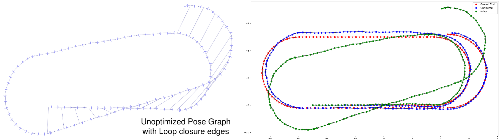
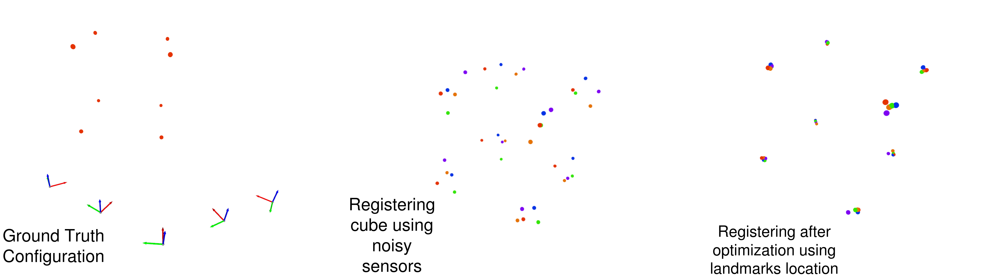

# GTSAM SLAM tutorials

Small, readable examples of graph-based SLAM with [GTSAM](https://gtsam.org/). The examples are Python reimplementations of toy problems from [g2o_tutorials](https://github.com/UditSinghParihar/g2o_tutorial).

The tutorials use synthetic data so the factors, noise models, and optimization steps stay easy to follow.

## Examples

### Pose-graph SLAM — [`pgSlam/pgSlam.ipynb`](pgSlam/pgSlam.ipynb)

A robot follows an oval path. Noisy wheel odometry creates drift; loop closures correct it.

- Generate a 120-pose ground-truth trajectory.
- Add noise to **relative odometry**, then integrate it to show drift.
- Build a `NonlinearFactorGraph` with a prior, 119 odometry factors, and 20 loop-closure factors.
- Optimize with GTSAM's Levenberg–Marquardt optimizer and inspect marginal covariances.
- The reusable helpers are in [`pgSlam/pgSlam.py`](pgSlam/pgSlam.py).



### Landmark SLAM — [`landmarkSlam/landmarkSlam.ipynb`](landmarkSlam/landmarkSlam.ipynb)

A robot observes the eight corners of a cube from five poses.

- Generate local landmark observations in each robot frame.
- Estimate relative motion with point-to-point ICP.
- Build a g2o text graph with `VERTEX_SE3:QUAT` robot poses, `VERTEX_TRACKXYZ` landmarks, and `EDGE_SE3_TRACKXYZ` observations.
- Optimize robot poses and cube landmarks together with GTSAM.
- The reusable helpers are in [`landmarkSlam/landmarkSlam.py`](landmarkSlam/landmarkSlam.py).



### Minimal GTSAM examples

[`Gtsam_examples/Pose2Slam.ipynb`](Gtsam_examples/Pose2Slam.ipynb) is a small 2D pose graph with a loop closure. [`Gtsam_examples/Landmark2DSlam.ipynb`](Gtsam_examples/Landmark2DSlam.ipynb) demonstrates pose and landmark optimization with `BearingRangeFactor2D`.

## Installation

The examples are tested with **GTSAM 4.3.0** and Python 3.11. A ready-to-use Conda environment is included:

```bash
conda env create -f environment.yml
conda activate gtsam-tut
```

Or install the Python dependencies into an existing Python 3.11+ environment:

```bash
python -m venv .venv
source .venv/bin/activate
python -m pip install -r requirements.txt
```

The landmark tutorial uses Open3D for optional 3D visualization. The optimization and all 2D examples run without a display.

## Running the examples

Start Jupyter from the repository root:

```bash
conda activate gtsam-tut
jupyter lab
```

The landmark helper can also be run as a headless script:

```bash
python landmarkSlam/landmarkSlam.py
```

Use `--show` to enable the optional Open3D windows when a display is available. Generated `.g2o` files are written to the current working directory and are ignored by Git.

## Repository layout

```text
pgSlam/       pose-graph notebook, helper module, and reference figures
landmarkSlam/ landmark notebook, helper module, and reference figures
Gtsam_examples/ minimal GTSAM notebooks
Media/        additional screenshots
```

The [Notion notes](https://hirohamada.notion.site/Graph-Based-SLAM-6e550b19ebff41b9a8550b9c4442d742) contain the original longer discussion of the examples.

## Notes

This repository does not currently include a separate license file. Check the repository history and upstream tutorial before reusing the examples.
